# LACP Deep Dive
Click [HERE](<https://www.cisco.com/c/en/us/support/docs/lan-switching/link-aggregation-control-protocol-lacp-8023ad/221051-troubleshoot-link-aggregation-control-pr.html> "Troubleshoot Link Aggregation Control Protocol (LACP) on Nexus" ) to review Cisco Troubleshooting Guide. 

## LACP Basic

1. LACP - Link Aggregation Control Protocol
2. LACP is from 802.1x (formerly 802.3ad)
3. LACP Terms
    * LAG - Link Aggregation Group
        * Connected Port-Channel Interfaces
    * Hot-Standby Link
        * rx/tx packets: no data packets
        * LACP allows max of 16 ports in a port-channel group, but only 8 can be active at a given time. NON-ACTIVE links in an LACP bundle are placed in HOT-STANDBY. Any active turns inactive, one hot standby will move to active. 
        * Conditions:
            * Link Limited by max-bundle 
        * vPC Condition:
            * vPC ports become HOT-STANDBY if **insync_wait_timer** time-out
    * Individual Link
        * rx/tx packets: any packets as normal link 
        * Conditions: not receiving any LACPDU
    * Suspend
        * rx/tx packets: no data packets
        * Conditions:
            * Not receive LACPDU
            * Link failed at LACP nego

    


## LACPDU

### 1. Link Aggregation Control Protocol Data Unit

* Through LACPDU, interface enabled LACP will transmit several factor to partner
    * System Priority
    * System MAC  -> PO interface MAC, not physical interface MAC. 
    * Interface Priority
    * Interface Number
    * Key -> Operational Key, represents PO Number. 

    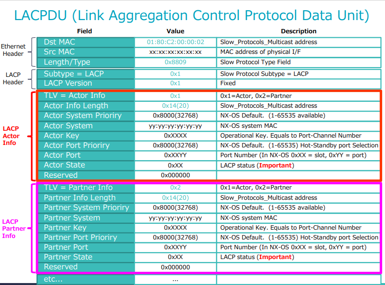


### 2. LACPDU Exchange
    
[Guide Link to Cisco Guide](<https://www.cisco.com/c/en/us/support/docs/lan-switching/link-aggregation-control-protocol-lacp-8023ad/221051-troubleshoot-link-aggregation-control-pr.html> "Troubleshoot Link Aggregation Control Protocol (LACP) on Nexus")


|Phase|Action|Device-1 State|Device-2 State|State Code|
|---|---|:---:|:---:|---|
|1 `->`| * Dev-1 send first actor LACPDU with state bits<br>*Partner info all set as 0|Actor<br><code style="color:blue">Activity=1<br>Timeout=1<br>Aggregate=1</code><br>`Sync=0`<br>`Collecting=0`<br>`Distributing=0`<br>`Default=0`<br>`Expired=0`<br>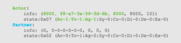|Partner<br>`Activity=0`<br>`Timeout=0`<br>`Aggregate=0`<br>`Sync=0`<br>`Collecting=0`<br>`Distributing=0`<br>`Default=0`<br>`Expired=0`|Actor=0x07<br>Partner=0x00|
|2 `<-`| * Dev-2 receive Dev-1's LACPDU<br>* Dev-2 response LACPDU with its own info in Actor part and ACK Dev-1's info.|Partner<br><code style="color:blue">Activity=1<br>Timeout=1<br>Aggregate=1</code><br>`Sync=0`<br>`Collecting=0`<br>`Distributing=0`<br>`Default=0`<br>`Expired=0`|Actor<br><code style="color:darkgreen">Activity=1<br>Timeout=1<br>Aggregate=1</code><br>`Sync=0`<br>`Collecting=0`<br>`Distributing=0`<br>`Default=0`<br>`Expired=0`<br>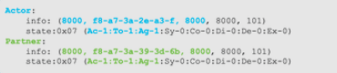|Actor=0x07<br>Partner=0x07|
|3 `->`| * Dev-1 ACK Dev-2 Info | Actor<br><code style="color:blue">Activity=1<br>Timeout=1<br>Aggregate=1</code><br>`Sync=0`<br>`Collecting=0`<br>`Distributing=0`<br>`Default=0`<br>`Expired=0`<br>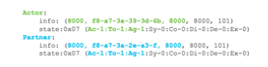| Partner<br><code style="color:darkgreen">Activity=1<br>Timeout=1<br>Aggregate=1</code><br>`Sync=0`<br>`Collecting=0`<br>`Distributing=0`<br>`Default=0`<br>`Expired=0`|Actor=0x07<br>Partner=0x07|
|4 `<-`|* Dev-2 receive ACK<br>* Dev-2 send LACPDU with sync=1|Partner<br><code style="color:blue">Activity=1<br>Timeout=1<br>Aggregate=1</code><br>`Sync=0`<br>`Collecting=0`<br>`Distributing=0`<br>`Default=0`<br>`Expired=0`|Actor<br><code style="color:darkgreen">Activity=1<br>Timeout=1<br>Aggregate=1</code><br><code style="color:orange">Sync=1</code><br>`Collecting=0`<br>`Distributing=0`<br>`Default=0`<br>`Expired=0`<br>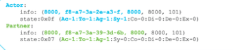|Actor=0x07<br>Partner=0x0F|
|5 `->`|<ul><li>Dev-1 acks Dev-2 SYNC</li></ul><br><ul><li>Dev-1 SYNC set 1 in its own actor </li></ul>|Actor<br><code style="color:blue">Activity=1<br>Timeout=1<br>Aggregate=1</code><br><code style="color:orange">Sync=1</code><br>`Collecting=0`<br>`Distributing=0`<br>`Default=0`<br>`Expired=0`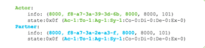|Partner<br><code style="color:darkgreen">Activity=1<br>Timeout=1<br>Aggregate=1<br>Sync=1</code><br>`Collecting=0`<br>`Distributing=0`<br>`Default=0`<br>`Expired=0`|Actor=0x0F<br>Partner=0x0F|
|6 `<-`|<ul><li>Dev-2 acks Dev-1 SYNC</li></ul><br><ul><li>Dev-1 ***Collect*** set 1 in its own actor </li></ul>|Partner<br><code style="color:blue">Activity=1<br>Timeout=1<br>Aggregate=1<br>Sync=1</code><br>`Collecting=0`<br>`Distributing=0`<br>`Default=0`<br>`Expired=0`|Actor<br><code style="color:darkgreen">Activity=1<br>Timeout=1<br>Aggregate=1<br>Sync=1</code><br><code style="color:orange">Collecting=1</code><br>`Distributing=0`<br>`Default=0`<br>`Expired=0`<br>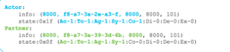|Actor=0x0F<br>Partner=0x1F|
|7 `->`|<ul><li>Dev-1 acks Dev-2 ***Collect*** from Dev-2</li><br><li>Dev-1 add ***Collect*** set 1 in its own actor </li></ul>|Actor<br><code style="color:blue">Activity=1<br>Timeout=1<br>Aggregate=1<br>Sync=1</code><br><code style="color:orange">Collecting=1</code><br>`Distributing=0`<br>`Default=0`<br>`Expired=0`<br>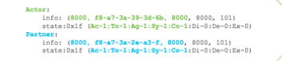|Partner<br><code style="color:darkgreen">Activity=1<br>Timeout=1<br>Aggregate=1<br>Sync=1<br>Collecting=1</code><br>`Distributing=0`<br>`Default=0`<br>`Expired=0`|Actor=0x1F<br>Partner=0x1F|
|8 `->`|<ul><li>Dev-1 decides ready to transition to distribute state </li><br><li>Then Dev-1 set its ***Timeout*** from 1 (fast) to 0 (slow) and ***Distribute*** to 1 </li></ul>|Actor<br><code style="color:blue">Activity=1</code><br><code style="color:red">*Timeout=0*</code><br><code style="color:blue">Aggregate=1<br>Sync=1<br>Collecting=1</code><br><code style="color:orange">*Distributing=1*</code><br>`Default=0`<br>`Expired=0`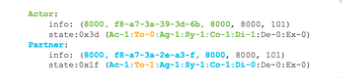|Partner<br><code style="color:darkgreen">Activity=1<br>*Timeout=1*<br>Aggregate=1<br>Sync=1<br>Collecting=1</code><br>`Distributing=0`<br>`Default=0`<br>`Expired=0`|Actor=0x3D<br>Partner=0x1F|
|9 `<-`|<ul><li>Dev-2 ack Dev's timeout=0 and Distribute=1</li><br><li>Dev-2 response with its own Timeout=0 and Distribute=1 </li><li>At this moment, both device are ready to send data on PO</li></ul>|Partner<br><code style="color:blue">Activity=1</code><br><code style="color:red">*Timeout=0*</code><br><code style="color:blue">Aggregate=1<br>Sync=1<br>Collecting=1<br>Distributing=1</code><br>`Default=0`<br>`Expired=0`|Actor<br><code style="color:darkgreen">Activity=1</code><br><code style="color:red">*Timeout=0*</code><br><code style="color:darkgreen">Aggregate=1<br>Sync=1<br>Collecting=1</code><br><code style="color:orange">Distributing=1</code><br>`Default=0`<br>`Expired=0`<br>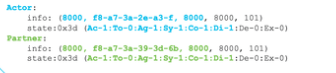|Actor=0x3D<br>Partner=0x3D|
|10 `->`|<ul><li>Dev-1 ack Dev-2's LACPDU</li><br><li>At this moment PO will transit to UP</li></ul>|Actor<br><code style="color:blue">Activity=1</code><br><code style="color:red">*Timeout=0*</code><br><code style="color:blue">Aggregate=1<br>Sync=1<br>Collecting=1<br>Distributing=1</code><br>`Default=0`<br>`Expired=0`<br>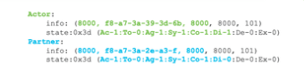|Partner<br><code style="color:darkgreen">Activity=1</code><br><code style="color:red">*Timeout=0*</code><br><code style="color:darkgreen">Aggregate=1<br>Sync=1<br>Collecting=1</code><br><code style="color:purple">Distributing=0</code><br>`Default=0`<br>`Expired=0`|Actor=0x3D<br>Partner=0x1D|


## LAG ID

* **[System Priority + System MAC + Key]** must be same over same LAG in one physical device. 
* System Identifier = <span style="color: green">**[System Priority + System MAC]**</span>
* Smaller *System Identifier* is in front. 

    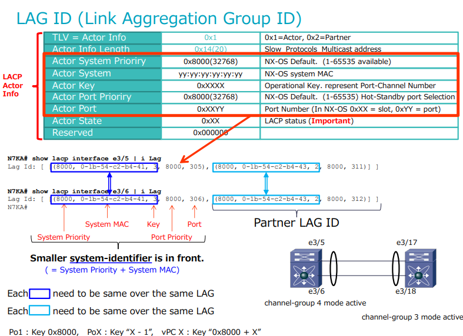

## LACP Status

* Status Code
    
    | Name |1 |0 | 
    |---|---|---| 
    | Activity | Active | Passive|
    | Timeout | Short Timeout | Long Timeout |
    | Aggregatable | Aggregatable | Individual | 
    | Sync | In Sync | Out of Sync |
    | Collecting | Collecting Enabled | Collecting Disabled |
    | Distributing | Enabled | Disabled |
    | Defaulted | Use Default for Partner | Use rx LACPDU for Partner Info |
    | Expired | Partner PDU Expired | Not Expired |  

* LACP Status size in packet: 1 bytes

    * Wireshake Actor State

        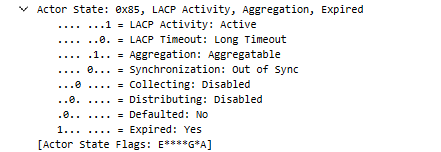

    * LACP state in Picture: 
        
        10000101<br>
        =Activity(1), Aggregation(4), Expired(128)<br>=133<br>
        =0X85

* LACP Status Caculation

    * Hexadecimal Representation 

        Each flag represens a specific bit in binary number. The overall state is summed by each value of active flags.

    * Flags and Bit

        |Flag |Bit |Decimal| Hexadecimal |Definitaion|
        |---|---|---|---|---|
        |Activity|0|1|0x01|LACP negotiation mode |
        |Timeout|1|2|0x02|LACPDU send/timeout timer `lacp rate fast`<br>short*: timeout 3 sec(tx 1 sec) <br> long: 90 sec (tx 30 sec) |
        |Aggregation|2|4|0x04|Aggregated if 1 is set|
        |Sync|3|8|0x08| In Sync: Port is aggregated as a Port-Channel with proper LAD ID <br> Out of Sync: No PDU is synced |
        |Collecting|4|16|0x10|Enabled: System is ready to **Receive** packets as port-chanel member| 
        |Distributing|5|32|0x20|Enabled: System is ready to **Transmit** packets as port-channel member|
        |Defaulted|6|64|0x40|1- Use Default for Partner Info <br>0- Use rx LACPDU for Partner Info |
        |Expired|7|128|0x60|1-Partner PDU Expired |


* LACP Status check demo from status in Nexus switch

    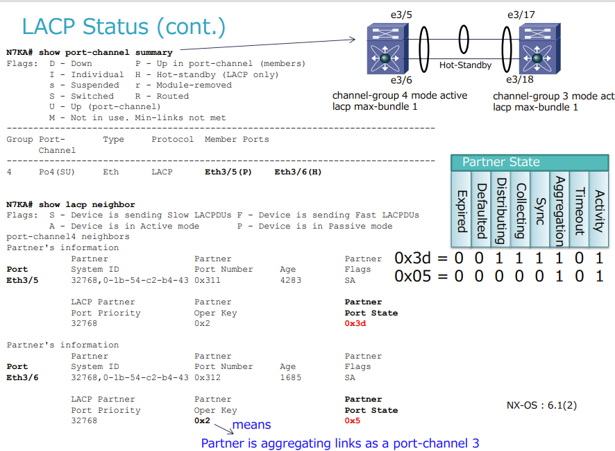

    <br>
~~~
    - two physical interfaces are configured into one port-channel;
    - only 1 physical interface can be added into port-channel 4/3 in the same time ```max-bundle 1```;
    - e3/5 is working as UP[P] and state code is 0x3d=00111101; 
    - e3/6 is Hot-standby[H] and state code is 0x05=00000101;
        + e3/6 is not blocked, but SYNC/Collecting/Distributing are all set 0;
~~~

## LACP Time Summary

### Timer Type

### How to Check LACP Timer

## LACP Status Transition

### LACP Status Transition N7K

### LACP Status Transition N5K

### How to track LACP Status Transition

### Transition Example

## LACP graceful-convergence

## LACP suspend-individual

## LACP and vPC


[1]:(https://www.ieee802.org/1/files/public/docs2018/ax-seaman-lacp-suggestions-0118-02.pdf)