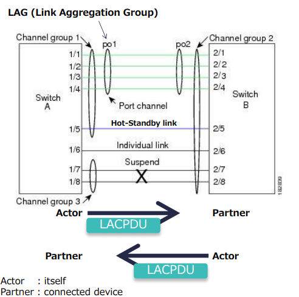
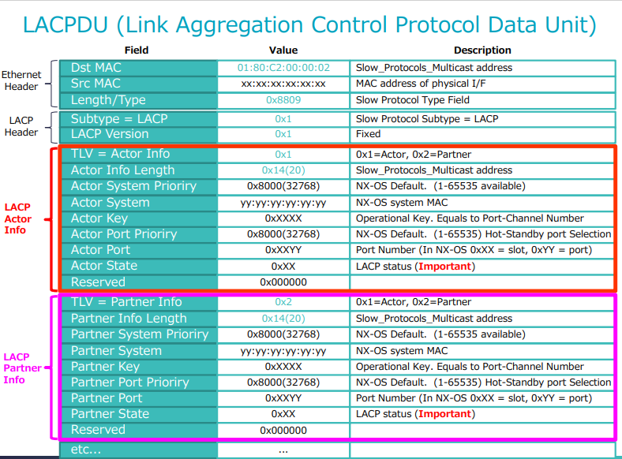
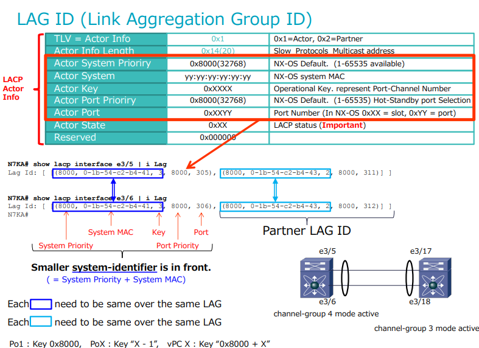
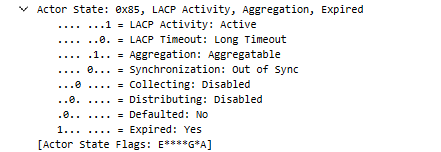

# LACP Deep Dive
Click [HERE](<https://www.cisco.com/c/en/us/support/docs/lan-switching/link-aggregation-control-protocol-lacp-8023ad/221051-troubleshoot-link-aggregation-control-pr.html> "Troubleshoot Link Aggregation Control Protocol (LACP) on Nexus" ) to review Cisco Troubleshooting Guide. 

## LACP Basic

1. LACP - Link Aggregation Control Protocol
2. LACP is from 802.1x (formerly 802.3ad)
3. LACP Terms
    * LAG - Link Aggregation Group
        * Connected Port-Channel Interfaces
    * Hot-Standby Link
        * rx/tx packets: no data packets
        * LACP allows max of 16 ports in a port-channel group, but only 8 can be active at a given time. NON-ACTIVE links in an LACP bundle are placed in HOT-STANDBY. Any active turns inactive, one hot standby will move to active. 
        * Conditions:
            * Link Limited by max-bundle 
        * vPC Condition:
            * vPC ports become HOT-STANDBY if **insync_wait_timer** time-out
    * Individual Link
        * rx/tx packets: any packets as normal link 
        * Conditions: not receiving any LACPDU
    * Suspend
        * rx/tx packets: no data packets
        * Conditions:
            * Not receive LACPDU
            * Link failed at LACP nego

    

## LACPDU

Link Aggregation Control Protocol Data Unit

* Through LACPDU, interface enabled LACP will transmit several factor to partner
    * System Priority
    * System MAC  -> PO interface MAC, not physical interface MAC. 
    * Interface Priority
    * Interface Number
    * Key

    

## LAG ID

* **[System Priority + System MAC + Key]** must be same over same LAG in one physical device. 
* System Identifier = **[System Priority + System MAC]**
* Smaller *System Identifier* is in front. 

    

## LACP Status

* Status Code
    
    | Name |1 |0 | 
    |---|---|---| 
    | Activity | Active | Passive|
    | Timeout | Short Timeout | Long Timeout |
    | Aggregatable | Aggregatable | Individual | 
    | Sync | In Sync | Out of Sync |
    | Collecting | Collecting Enabled | Collecting Disabled |
    | Distributing | Enabled | Disabled |
    | Defaulted | Use Default for Partner | Use rx LACPDU for Partner Info |
    | Expired | Partner PDU Expired | Not Expired |  

* LACP Status size in packet: 1 bytes

    * Wireshake Actor State

        

    * LACP state in Picture: 
        
        10000101 
        =Activity(1), Aggregation(4), Expired(128) =133 
        =0X85

* LACP Status Caculation

    * Hexadecimal Representation 

        Each flag represens a specific bit in binary number. The overall state is summed by each value of active flags.

    * Flags and Bit

        |Flag |Bit |Decimal| Hexadecimal |Definitaion|
        |---|---|---|---|---|
        |Activity|0|1|0x01|LACP negotiation mode |
        |Timeout|1|2|0x02|LACPDU send/timeout timer `lacp rate fast` short*: timeout 3 sec(tx 1 sec)   long: 90 sec (tx 30 sec) |
        |Aggregation|2|4|0x04|Aggregated if 1 is set|
        |Sync|3|8|0x08| In Sync: Port is aggregated as a Port-Channel with proper LAD ID   Out of Sync: No PDU is synced |
        |Collecting|4|16|0x10|Enabled: System is ready to **Receive** packets as port-chanel member| 
        |Distributing|5|32|0x20|Enabled: System is ready to **Transmit** packets as port-channel member|
        |Defaulted|6|64|0x40|1- Use Default for Partner Info  0- Use rx LACPDU for Partner Info |
        |Expired|7|128|0x60|1-Partner PDU Expired |

## LACP Time Summary

### Timer Type

### How to Check LACP Timer

## LACP Status Transition

### LACP Status Transition N7K

### LACP Status Transition N5K

### How to track LACP Status Transition

### Transition Example

## LACP graceful-convergence

## LACP suspend-individual

## LACP and vPC

