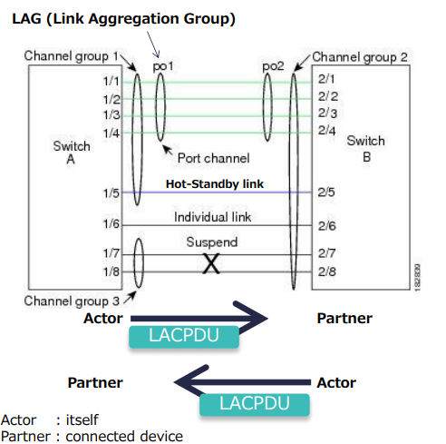

# Nexus LACP Deep Dive

## LACP Basic

1. LACP - Link Aggregation Control Protocol
2. LACP is from 802.1x (formerly 802.3ad)
3. LACP Terms
    * LAG - Link Aggregation Group
        * Connected Port-Channel Interfaces
    * Hot-Standby Link
        * rx/tx packets: no data packets
        * Conditions:
            * Link Limited by max-bundle 
        * vPC Condition:
            * vPC ports become HOT-STANDBY if **insync_wait_timer** time-out
    * Individual Link
        * rx/tx packets: any packets as normal link 
        * Conditions: not receiving any LACPDU
    * Suspend
        * rx/tx packets: no data packets
        * Conditions:
            * Not receive LACPDU
            * Link failed at LACP nego

    

## LACPDU

## LAG ID

## LACP Status

## LACP Time Summary

### Timer Type

### How to Check LACP Timer

## LACP Status Transition

### LACP Status Transition N7K

### LACP Status Transition N5K

### How to track LACP Status Transition

### Transition Example

## LACP graceful-convergence

## LACP suspend-individual

## LACP and vPC

