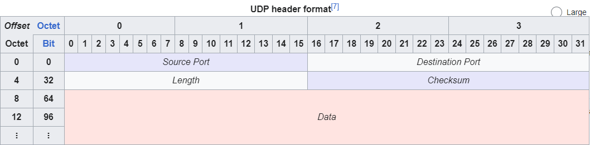

# UDP Breakdown

## UDP Basic Information

### UDP character

* each output of process will generate a UDP datagram 
* each Datagram will be encapsulated with IP header 
* Not reliable 
* Applicaiton will consider its payload size. 

### Datagram vs Stream

* Datagram: Each of the data released from APP layer will form their own Datagram in UDP. 
* Stream: TCP layer (instead of APP layer) will decide size of each packet.
    * Samll data stream will be encapsulated and transmitted
    * Large data will be segmented at TCP layer and transmitted. 

            Why IPsec VPN is much more quicker than normal RAVPN:
            As IPSEC is adopting UDP, each packet has simple purpose of negotiation and data transmition. 
            While TCP's negotation content in packet is not fixed, and will be segmented and reorder&reassembled when received by terminal. 

### Main APPs that adopts UDP

* Query: DNS
    * Not reqired for 3 time handshke
    * Queries can be done in the same time
* Data transfer: TFTP
    * Stop and wait if the APP-Layer ack is not received 
* Voice and Media
    * Support broadcast and multicast (TCP does not have multicast)
    * Allow packet loss for efficiency 


## UDP Header


```
Consistant: 4 fields, each of which is 2 bytes (12bits).
    * Source Port: 16 bits  --> Optional in IPv4/IPv6
    * Destination Port: 16 bites
    * Length: 16 bits
    * Checksum: 16 bits  --> Optional in IPv4
```

### 1. Source Port
### 2. Destination Port
### 3. Length

* This field identifies length of a UDP Datagram 
* Include `header` and `Payload`
* Minimum length is `8 bytes`<span style="color:purple">(Header Length)</span>
* UDP Datagram Size Limit: `65535 bytes`<span style="color:purple">(8 bytes header + 65527 bytes of data)</span>
* Actual Limit = 65535 - 8 bytes of UDP header - 20 Bytes of IP header = 65507


### 4. Checksum

* Used for `error-checking`
* Optional in IPv4, but mandatory in IPv6. 


### 5. UDP CheckSum Computing


* Complement sum of `UDP Header`, `payload`, `pseudo-header(伪头部) with`<code style=color:red>ip address（es), protocol and UDP length</code>

* Steps:

    - Construct **Pseudo-Header**

        + **Source IP** - 4 bytes
        + **Destination IP** - 4 bytes
        + **Protocol** - 1 bytes (UDP:17)
        + **UDP Length** - 2 bytes (UDP Header + UDP Data)

                Example: 
                Source IP: 192.0.2.1 (hex: C0 00 02 01)
                Destination IP: 198.51.100.1 (hex: C6 33 64 01)
                Protocol: 17 (hex: 11)
                UDP Length: 20 (header + data) (hex: 00 14)
                
                Pseudo-header = C0 00 02 01 C6 33 64 01 11 00 14

    - Prepare **UDP Header and Data**

        + **Source Port** - 2 bytes
        + **Destination Port** - 2 bytes
        + **Length** - 2 bytes (UDP Header + UDP Data)
        + **Checksum** - 2 bytes (initially, all set 0 for calculation)
        + **Data** 

                Example:
                Source Port: 12345 (hex: 30 39)
                Destination Port: 80 (hex: 00 50)
                UDP Length: 20 (header + data) (hex: 00 14)
                Data: "Hello" (hex: 48 65 6C 6C 6F)

                UDP Header + UDP Data = 30 39 00 50 00 14 00 00 + 48 65 6C 6C 6F


    - Combine above both

        + Concatenate a.`pseudo-header`+b.`udp header`+c.`actual udp data` into one single stream of bytes.

                Example:

                Combined: C0 00 02 01 C6 33 64 01 11 00 14 30 39 00 50 00 14 00 00 48 65 6C 6C 6F


    - Device into 16-bit words

        + Spilt combined data into 16-bit words;
        + If total length is odd, padding 0 to make it complete 16 bit word

                Example:
                C000 | 0201 | C633 | 6401 | 1100 | 1400 | 0000| 4865 | 6C6C | 6F (padding to 6F00 by adding another two 0s behind) 

    - Sum 16-bit words

        + Add together in Hex. 

                Example: 
                Sum = C000 + 0201 + C633 + 6401 + 1100 + 1400 + 0000 + 4865 + 6C6C + 6F00 = 33506

                33506 exceeds 16 bits of FFFF

                33506 = 210182 in decimal mod \(2^{16}\)*x= =13574 = 0x3506 in hex. 
                


    - Calculate *One's Complement*

        + One's Complement 

                Example:
                0xFFFF - 0x3506 = 0xCAF9 

    - Insert Checksum