# TCP basic Breakdown

## TCP Header

### TCP Service

* Transmission-Control-Protocol
* Realiable, ordered, error-checked (adds reliability, but lengthens latency)
* Stream of octets(each byte) service
* Connection oriented  
* Not support Multicast or Broadcast 
* TCP do not care content of byte stream, nor explain to any layer. 
* Intermediate Level between IP and Application Layer (through Network Socket Interface connected to App layer)
* TCP is Full-duplex. 

### TCP Stream

* TCP accepts data from a Data Stream.
    * End Host Processes transmit data by calling TCP;
    * The data will come from Application Layer to Buffer;
    * Then TCP packages the data from buffers into segment; 
    * Then TCP calls IP and transmit. 
* It devides the Data into `chunks`, 
* It adds TCP Header to each chunk and form TCP Segment,
* The Segment is then encapsulated into IP datagram and exchange with peer. 

    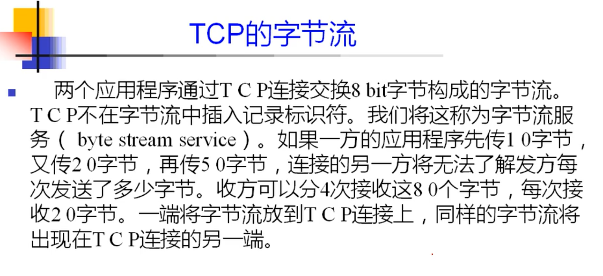   
    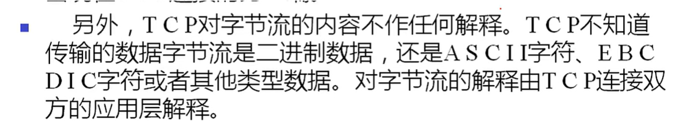 

### Header

TCP Segment consists of 10 mandatory fields and 1 optional extension filed  

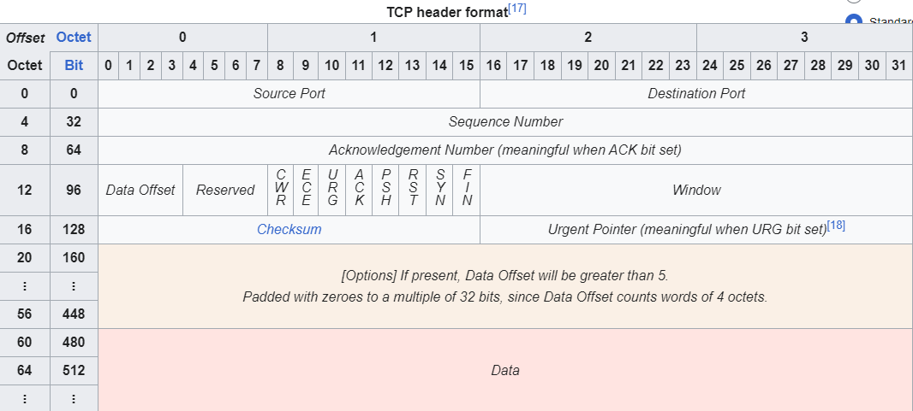

PCAP of TCP Header:
    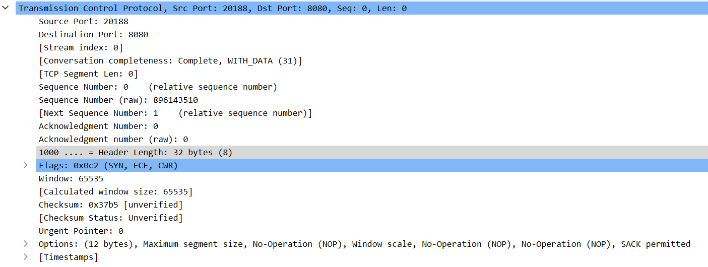
    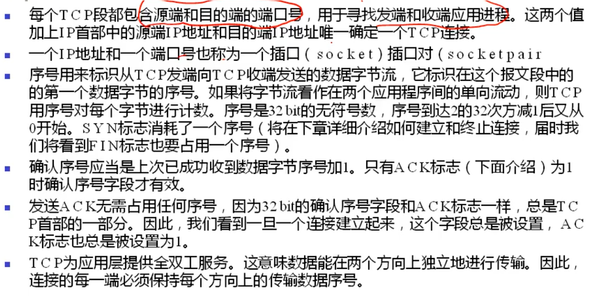
    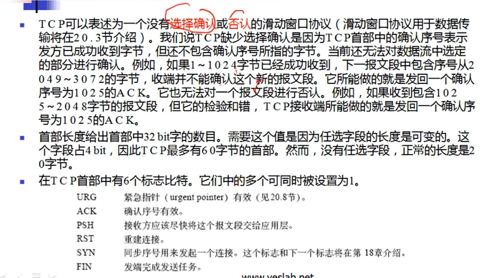

#### Source Port - 16 bits
#### Destination Port - 16 bits

* To confirm a connection requires `src.ip, src.port, dst.ip, dst.port`
* `src.ip + src.port` forms a socket in one host
* Five Tuple : `src.ip src.port dst.ip dst.port protocol `

#### Sequence Number - 32 bits

* Dual Role
    * if SYN flag is set 1, then this is initial sequence number; 
    * If SYN flag is set 0, then this is the accumulated seq number of the first data byte of this segment from current tcp session. 
    * SYN/FIN flag will cost one sequence.

#### Acknoledgment Number - 32 bits

* ACK = sender's seq + 1
* When ACK is set, the value of this field is next sequence number that the responder is expecting.  
* This ACK acknowledge received of all prior bytes. 
* ACK Flag will not cost any sequence. 

#### Data Offset - 4 bits

* Specify size of TCP Header.
* The purpose of the Data Offset is to tell upper layer where the header ends and where the Data starts. 
* Generally when the header is 20 bytes, the Offset will be 0101=5 -> 20 bytes, when there is option in header, like SYN, the Offset may become 1000=8 -> 32 bytes.
* Max of offset is 1111=15 -> 60 bytes

#### Reserved - 3 bits

* Bits of this field are set to 0;
* Reserved for later use
* Sender should not set these bits
* Receiveds should ignore these if set
* Contains in Flags 
    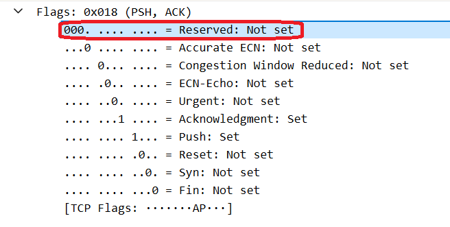

* Accurate ECN
    * ECN - Explicit Congestion Notification
    * ECN is a mechanism to let network nodes mark IP packets to indicate congestion to endpoints, rather then drop them. 
    * [RFC7560][1] will reveal more 

#### Flags - 8 bits

* Eight(8) 1-bit-flag as follow:

##### CWR - 1 bit

* Congestion Window Reduced
* CWR to acknowledge that the *Congestion Indicator* echoing was received. 
* CWR is set to indicate:
    * Sender received a TCP segment with ECE flag set
    * and responded in congestion control mechanism 
* [RFC3168][2] will show more detail

##### ECE - ECN-Echo - 1 bit

* ECE is used to echo back the *Congestion indicator* (singal the sender to reduce the transmition rate).

* Dual Role:
    * If SYN is set as 1, TCP peer is ECN capable
    * If the SYN flag is 0,  ECN=11 will set in its IP header 

    ###### Operations of ECN 

    When ECN is negotiated on a TCP connection:

    * Sender indicate IP header that this is ECN Capable Transport
    * IP header then has the ***Explicit Congestion Notification: ECN-Capable Transport codepoint*** set as `10` 
    
        **TCP Flags**
        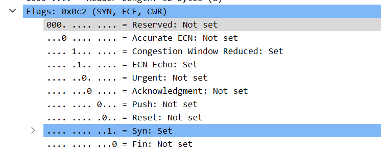

        **IP Flags**
        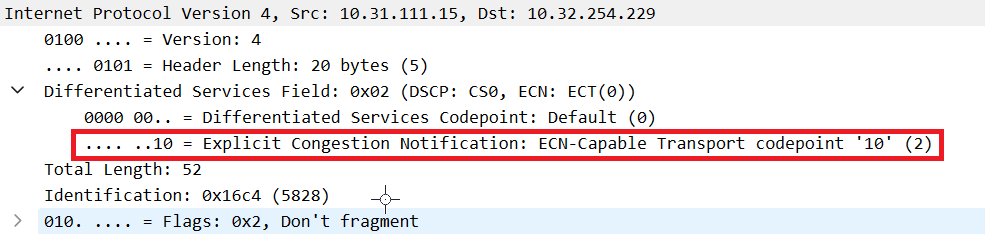

    * Intermiate Routes that support ECN will mark those IP Packets with CE`Congestion Experienced 11` code point, instead of dropping them, and send to receiver. 
    * As a result, the flow is marked as singal impending congestion. 
    * When Receiver receives and IP packet with CE code point, the upper layer, TCP, echoes back Congestion Indication using ECE flag in TCP header. 
    * When the original Sender receives TCP segment from original Receiver with ECE bit set, it reduces its Congestion Window and transmission rate 
    * Then the Sender will response a tcp segment with a CWR bit set. 
    * A node keeps transmitting EVE bit set, until it receives a CWR bit set. 
    * Filter with TCPDUMP, `(tcp[13] & 0xc0 != 0)`
    * Require both endpoints and underlaying infrastructe all support such mechanism 

##### URG - 1 bit

* Indicates data in TCP segment is urgent, needs to be processed ASAP, without any waiting for rest of data to arrive. 
* URG flag is accompanied by a 16-bit *urgent pointer* field, 
* *urgent pointer* specifies the *offset* from current sequence number to end of urgent data. 
* Receiver will use *urgent pointer* to locate and process urgent data before normal data. 

##### ACK - 1 bit

* All Packets after the initial SYN packet sent by client should have this set. 

##### PSH - 1 bit

* Ask Receiver to push the buffered data to receiving applicatoin. 

##### RST

* Abortive release.
* Reset the conneciton.

##### SYN

* Synchronize sequence number.
* Only first packet sent by both should have this bit set. 
* 

    Initial sequence: Add 1 from 0 every 8ms Increase 64000 every 0.5 seconds Return to 0 every 9.5 hours For each of new conneciton, seq +64000
    

##### FIN

* Last packet from both end. 

#### Window

* Specify receiver's window
* Specify the number of window size units that sender is willing to receive. 
* Maximum 65536 for bit-size of window is 16 bit.
* CONTROL of RECEIVING: 
    
    * When A is transmiting to B, B informs A a certain size of Window, 
    * then A will be able to send THAT CERTAIN size of data, which is the size of B's window *without* receiving ACK of previous sent packets

#### Checksum - 16 bits

* **Mandantory** in TCP *(optional in UDP)*
* Used for Error-Checing of TCP Header, Payload and Pseudo-Header of IP. 
* Consist of IP Pseudo-Header:
    * Src.IP
    * Dst.IP
    * Protocol Number
    * Length of TCP headers and Payload (in bytes)

#### Urgent Pointer - 16 bits

* When URG is set 
* 16 bits is an offset from the current Seq number , indicating the last urgent data byte. 
* LAST Byte of urgent = Seq value + Urgent Pointer value

#### Options

* Variable ~ [0-320 bits], in unit of 32 bits;
* [Size-of-Options] = (Data Offset -5 <!--- 20 bytes of normal header ---> ) * 32

* Options have up to THREE fields:
    
    * Option-kind 
        * 1 byte
        * Indicate type of option
        * NOT optional
        * Next two fields' value is determined by this field.
    * Option-length
        * 1 byte
        * Indicate the total length of OPTION， including OPTION-KIND and OPTION-Length
    * Option-data
        * Size Variable
        * Contains data associated to Option. 

    |OPTION-KIND|OPTION-LENGTH|OPTION-DATA|Purpose|Notes|
    |---|---|---|---|---|
    |0|-|-|End of option list|
    |1|1|-|No-Operation|1. Align options fields on 32-bit boundaries 2. Only for padding 3. No Operation Option 4. 1-byte  5. does not have OPTION-Length or Option-Data 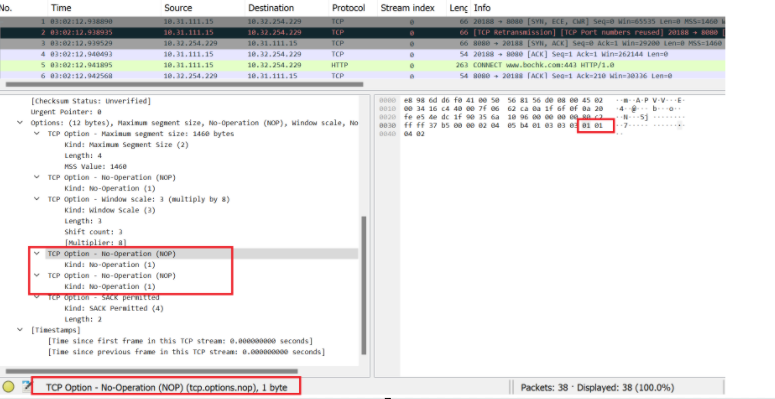|
    |2|4|SS|MSS Maximum Segment Size|ONLY BE SENT when `SYN` is set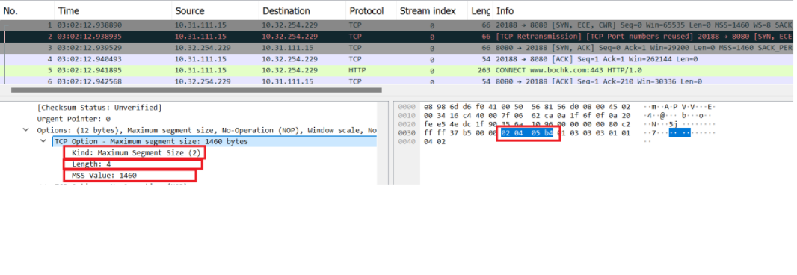 [MSS info from wiki](https://en.wikipedia.org/wiki/Transmission_Control_Protocol#Maximum_segment_size)  [MSS in this chapter](#mss)|
    |3|3|S|Window Scale|ONLY BE SENT when `SYN` is set|
    |4|2|-|Selective Achnowledgement||
    |5|N(10,18,26,or,34)|BBBB,EEEE,....|Selective ACKnowledgement SACK||
    |8|10|TTTT,EEEE|Timestamp and echo of previous timestamp||
    |28|4|-|User Timeout Option||
    |29|N|-|TCP Authentication Option(TCP-AO)||
    |30|N|-|Multipath TCP||

#### Data

The payload of the TCP packet.

## TCP Connection

TCP operations may be devided into three phases.

* Connection Establishment - multi-step handshake
* Data Transfer
* Connection Termination - close conneciton & release resources allocated
* Connections are managed by ***Internet Socket*** [socket](https://en.wikipedia.org/wiki/Unix_domain_socket), end-point operation system allocated resources

### TCP State

* During lifetime of a TCP connection, the local endpoint undergoes a series of TCP State change:

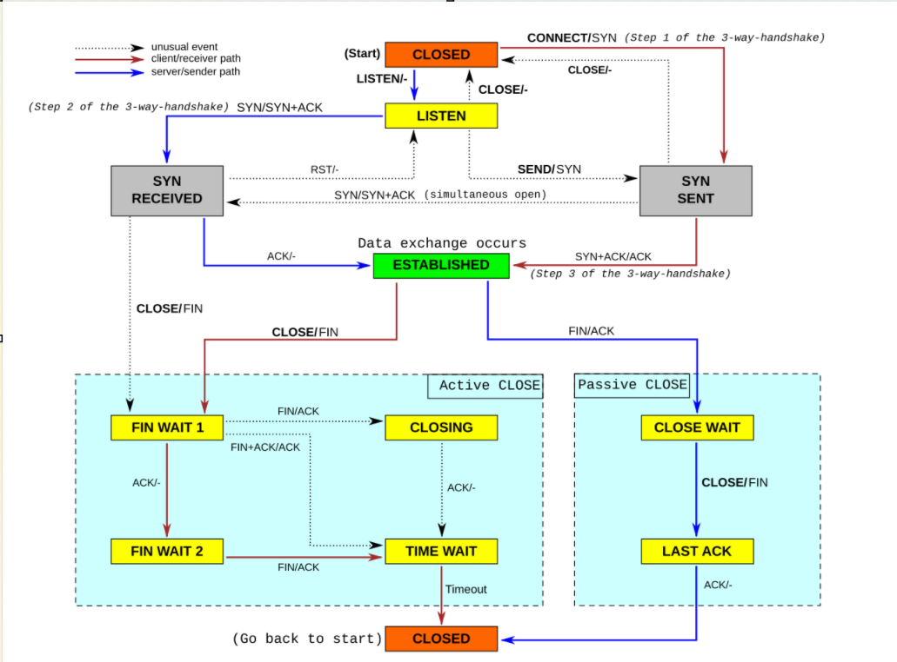

|**State**|**Endpoint**|**Description**|
|---|---|---|
|LISTEN|Server|Waiting for a `connection request` from any remote TCP end-point(client) |
|SYN-SENT|Client|Sent a `connection request` and wait for a matching `connection request` |
|SYN-RECEIVED|Server|* Having both received and sent a `connection request` * Waiting for a confirming `connection request acknowledgement`|
|ESTABLISHED|Server & Client|* Open Connection  * Data received can be delivered to user * Normal State for data transfer phase of the connection|
|FIN-WAIT-1|Server & Client|* Wait for a `Connection termination Request` from remote TCP * or an ACK of the `Connection Termination Request` previously sent|
|FIN-WAIT-2|Server & Client|* Wait for a `Connection Termination Request` from remote TCP|
|CLOSE-WAIT|Server & Client|Wait for `Connection Termination Request` from local user|
|CLOSING|Server & Client|Wait for `Conneciton Termination Request ACK` from remote TCP|
|LAST-ACK|Server & Client|Wait for the `ACK` of the `Conneciton Termination Request` previously sent to remote TCP|
|TIME-WAIT|Server or Client|Wait for enough time to pass, to b e sure all remaining packets on the connection have expired|
|CLOSED|Server and Client|NO connection|

### Three-Time Handshake

#### Connection Establishment

* Passive Open: 
    * Server
    * Bind to and Listen at a port to open for connection 
* Active Open:
    * Client
    * Using Three-way handshake

* 3-way-handshake
    * SYN
        * Seq-C number to a random A
    * SYN+ACK
        * ACK-S = A + 1
        * Seq-S = random B
    * ACK
        * ACK-C = B + 1
        * Seq-C = A + 1

* 
<a style="background-color: rgb(250, 150, 50);">
Both C and S receives ACK, the connection will be ready for Full-Duplex Communication 
</a>

### Four-Way Handshake

* FOUR time handshake is required to avoid `HALF-CLOSE` for Full-Duplex reason. 
* Each side terminates independently.
* Sending FIN means sending side tries close its half. Thus require pair of FIN and ACK from each end. 
* Client active close by sending *FIN* and become `FIN_WAIT_1`
* Server receives *FIN* and *ACK* the fin then become `CLOSE_WAIT` and start Passive CLose
* Server sends its own *FIN* and change into `LAST_ACK`
* Client receives *Server FIN* and change into `FIN_WAIT_2` and response ACK
* At this stage, Client side conneciton does NOT directly change to CLOSE, 
* Client will wait for a *Timeout* and change its state to [TIME_WAIT](#2msl-waiting-time_wait)
* in `TIME_WAIT`, source port is unavailable for new connection, and if client receives another FIN from server, it means the last ACK from client is missing, it shall resend the last ACK 
* Some common value of the `Time_Wait` are 30 seconds, 1 mins, and 2 mins. 
* After timeout, the Client enters `CLOSED` and the local port is released for new connections.

    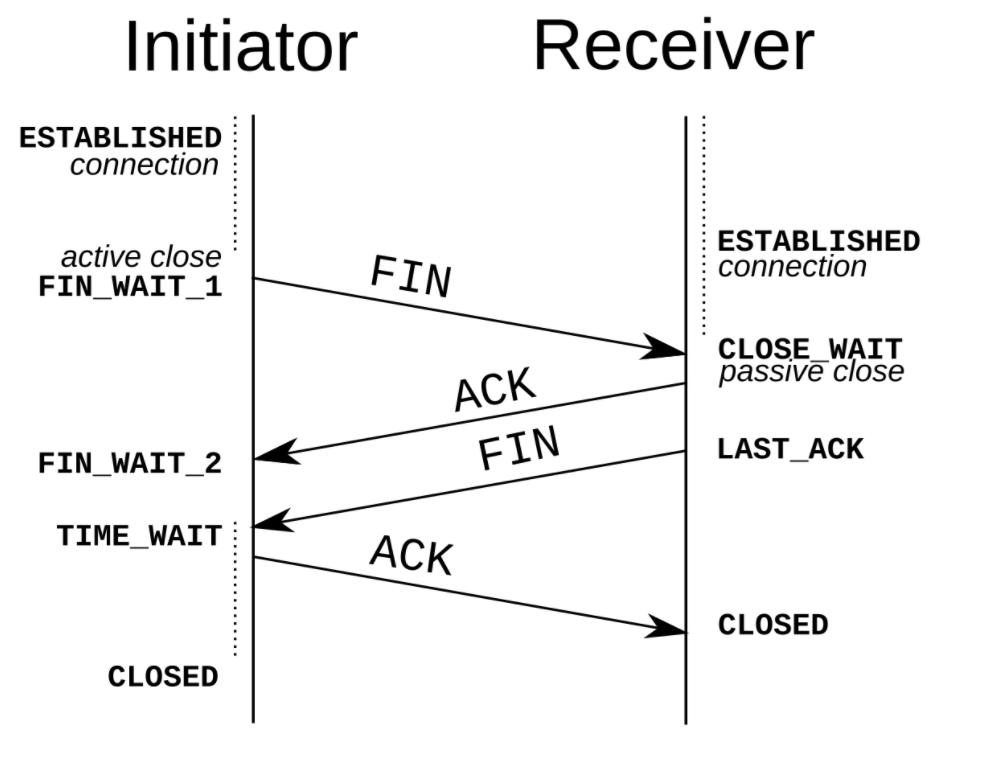

### MSS

* Maximum Segment Size, describes the largest acount of data that TCP is willing to receive in a single segment
* Specified in bytes
* Announced by each side using TCP MSS Option. 
* Ethernet protocol adopts 1460 bytes
* 802.x protocol adopts 1452 bytes
* MSS default value is 536 bytes

### TCP Half-Close

* One side terminated the connection
* the other side has not
* Terminated side cannot send data any longer
* Un-terminated side still can send data
* Terminated side should continue reading the data until the other side terminates. 
* But the terminated side can also choose to send RST to assure that TCP application is aware there was a data loss. 

    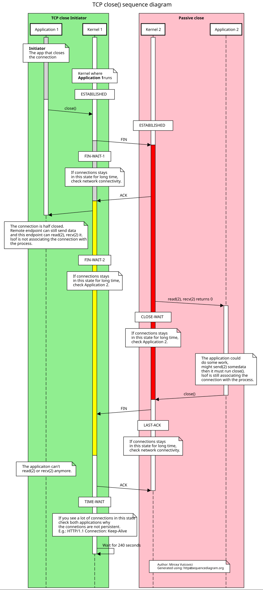

### 2MSL Waiting (TIME_WAIT)

* [MSL][3:MSL] - Maximum Segment Life - 报文段最大生存时间
* Pricipal for MSL - 
    * When a TCP active close by sending FIN , receiving responding FIN+ACK and sendomg the last ACK;
    * It goes into status of [TIME_WAIT];
    * Time range is ***2MSL***;
* **Purpose**: to let Client has chance to send the last ACK for a second time, in case the original last ACK missing <code style="background color: rgb(250, 150, 50);">such case may happen when sender receives a second FIN from server, indicating a timeout re-transmission and the last ACK is not received by server </code> , as described in [Four-Way Handshake](#four-way-handshake)
* **Feature**: 
    * socket for client cannot be released for reuse until `TIME_WAIT` timeout
    * socket for server on client side cannot be acknowledged. 
    * any late packet will be dropped, as for reason of *Feature 1&2*. 
    
* **Effect**: on only Active Close , passive close by receiving the first FIN will not go into this state. 

### FIN_WAIT_2

* FIN_WAIT_1 - sending the first FIN
* FIN_WAIT_2 - receving ACK for the first FIN
* If the other side does not send back FIN, sender may stuck at `FIN_WAIT_2` and receiver may stuck at `CLOSE_WAIT`, until Application Layer decides to move on. 

## TCP Interactive Stream

Main TCP streams has two types:

* BLOCKS 
    * FTP, Emails, etc.
    * Contains 90% of TCP streams
 
* INTERFACTIVE
    * Telnet, Rlogin, etc.
    * 10% around in ratio. 
    * Feature: Packets are ***MANY in quantity but SMALL in size***

### Interactive Stream

Interactive Stream is like to login to telnet, type in command letter by letter;

When you type a command, ***four*** packets will be generated for each letter:
* Each letter will become a packet and send to server, 
* which will result server ACK each letter, 
* and when the display shows the typed letter, this will also be formed as a packet send back to client, 
* and client will then ACK the display.

### TCP delayed acknowledgment 

* [Delayed ACK][4-Dealayed_ACK] in wifi
* Not ack each packet, wait for several amount of packets to be received and ACK together.
* **Limitation**
    * Maximum wait time : 200ms

### Nagle Argorithm

* 
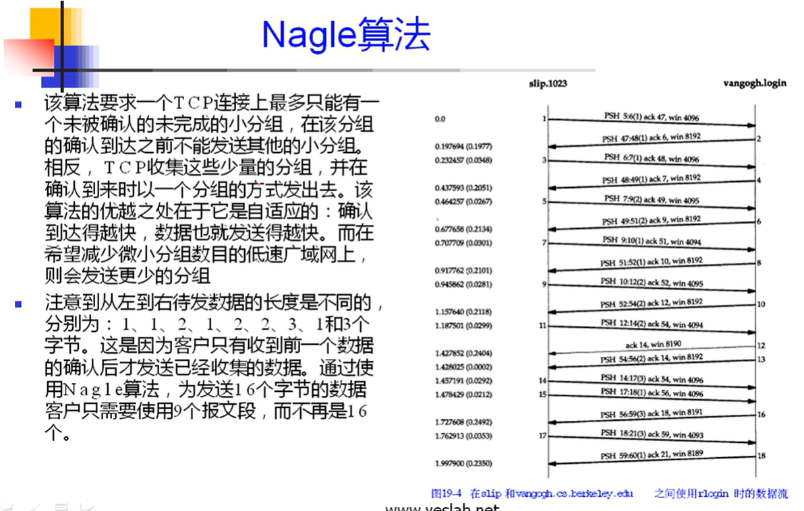

## TCP Sliding Window

### Windows Size

### Sliding Window

### How Wireshark read window size 

### TCP Slow Start

### 

## TCP Re-transmission and Timers

### TCP Timeout Retransmission 

### TCP Fast Transmission

### Selected ACK 

### Duplicated SACK 

### Presist Timer

## TCP Keepalive

## TCP Function  

[1]:[https://www.rfc-editor.org/rfc/rfc7560.txt]
[2]:[https://datatracker.ietf.org/doc/html/rfc3168]
[3:MSL]:[https://en.wikipedia.org/wiki/Maximum_segment_lifetime]
[4-Dealayed_ACK]:[https://en.wikipedia.org/wiki/TCP_delayed_acknowledgment]